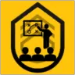

<a name="readme-top"></a>

[![Contributors][contributors-shield]][contributors-url]
[![Forks][forks-shield]][forks-url]
[![Stargazers][stars-shield]][stars-url]
[![Issues][issues-shield]][issues-url]


<!-- PROJECT LOGO -->
<br />
<div align="center">
  <a href="https://github.com/Kaffeedor/squadtraining">
    
  </a>

<h3 align="center">Squad Training Stuff</h3>

  <p align="center">
    A small Discord bot for the "Squad Training" Community.
    <br />
    <a href="https://github.com/Kaffeedor/squadtraining/issues">Report a Bug</a>
    ·
    <a href="https://github.com/Kaffeedor/squadtraining/issues">Request a Feature</a>
  </p>
</div>


<!-- TABLE OF CONTENTS -->
<details>
  <summary>Table of Contents</summary>
  <ol>
    <li>
      <a href="#about-the-project">About The Project</a>
      <ul>
        <li><a href="#built-with">Built With</a></li>
      </ul>
    </li>
    <li>
      <a href="#getting-started">Getting Started</a>
      <ul>
        <li><a href="#installation">Installation</a></li>
      </ul>
    </li>
    <li><a href="#usage">Usage</a></li>
    <li><a href="#roadmap">Roadmap</a></li>
    <li><a href="#contributing">Contributing</a></li>
    <li><a href="#contact">Contact</a></li>
    <li><a href="#contributors">Contributors</a></li>
    <li><a href="#acknowledgements">Acknowledgements</a></li>
  </ol>
</details>


<!-- ABOUT THE PROJECT -->
## About The Project

(The File Data is so "over-done" in case it is gonna get more dynamic in the future with editing specific RoleList Embeds etc. It is not really needed right now.)

<p align="right">(<a href="#readme-top">back to top</a>)</p>


### Built With

* [![Node][Node.js]][node-url]
* [![Discord][Discord.js]][discord-url].js

<p align="right">(<a href="#readme-top">back to top</a>)</p>


<!-- GETTING STARTED -->
## Getting Started

### Installation

1. Go to [Discord Developers](https://discord.com/developers) and create a new application.
2. Add a  new Bot and copy the Bot Token to somewhere safe. Also make sure to turn on all intents so you don't have to deal with weird errors that may occur.
3. Go to "OAuth2" -> "URL Generator", check the boxes "Bot" and "applications.commands" and open it to invite the Bot to your Discord Guild (aka. Discord Server).
4. Clone the repo.
   ```sh
   git clone https://github.com/Kaffeedor/squadtraining.git
   ```
5. Install NPM packages (check [package.json](https://github.com/Kaffeedor/squadtraining/blob/main/package.json) for dependecies).
   ```sh
   npm install
   ```
6. Enter all the Tokens and IDs required in [.env.example](https://github.com/Kaffeedor/squadtraining/blob/main/.env.example) in your `.env`.
7. Deploy the commands (This will only make them locally available in your Guild; check (deploy-commands.js)[https://github.com/Kaffeedor/squadtraining/blob/main/src/deploy-commands.js] for more).
   ```sh
   npm run deployCommands
   ```

<p align="right">(<a href="#readme-top">back to top</a>)</p>


<!-- USAGE EXAMPLES -->
## Usage

Start the bot:

    - For running it one time use:
       ```sh
       npm run start
       ```

    - For keeping it running while changing and editing files use:
       ```sh
       npm run dev
       ```

Type "/" in your Discord Server where the bot is and you should be able to see and use all commands (that are currently working).

<p align="right">(<a href="#readme-top">back to top</a>)</p>


<!-- ROADMAP -->
## Roadmap

- [x] Basic Bot setup
- [x] Ping Command
- [ ] Role List
    - [x] Command
    - [ ] Automatic updating
    - [ ] Set right pictures and colors
- [x] Set Presence Command
- [ ] Auto VC Member count
- [ ] /endround command

See the [open issues](https://github.com/Kaffeedor/squadtraining/issues) for a full list of proposed features (and known issues).

<p align="right">(<a href="#readme-top">back to top</a>)</p>


<!-- CONTRIBUTING -->
## Contributing

If you have a suggestion that would make this better or want to help fix something, please fork the repo and create a pull request. You can also simply open an issue with the corresponding tag.

1. Fork the Project
2. Create your Feature Branch (`git checkout -b feature/AmazingFeature`)
3. Commit your Changes (`git commit -m 'Add some AmazingFeature'`)
4. Push to the Branch (`git push origin feature/AmazingFeature`)
5. Open a Pull Request

<p align="right">(<a href="#readme-top">back to top</a>)</p>


<!-- CONTACT -->
## Contact

Murphy - [Discord: cato#0487](https://discordapp.com/users/299231065783009290)

Project Link: [https://github.com/Kaffeedor/squadtraining](https://github.com/Kaffeedor/squadtraining)

<p align="right">(<a href="#readme-top">back to top</a>)</p>


<!-- CONTRIBUTORS -->
## Contributors

* [Murphy](https://github.com/Kaffeedor)

<p align="right">(<a href="#readme-top">back to top</a>)</p>


<!-- ACKNOWLEDGEMENTS -->
## Acknowledgements

* [ReadmeTemplate](https://github.com/othneildrew/Best-README-Template)

<p align="right">(<a href="#readme-top">back to top</a>)</p>


<!-- MARKDOWN LINKS & IMAGES -->
[contributors-shield]: https://img.shields.io/github/contributors/Kaffeedor/squadtraining.svg?style=for-the-badge
[contributors-url]: https://github.com/Kaffeedor/squadtraining/graphs/contributors
[forks-shield]: https://img.shields.io/github/forks/Kaffeedor/squadtraining.svg?style=for-the-badge
[forks-url]: https://github.com/Kaffeedor/squadtraining/network/members
[stars-shield]: https://img.shields.io/github/stars/Kaffeedor/squadtraining.svg?style=for-the-badge
[stars-url]: https://github.com/Kaffeedor/squadtraining/stargazers
[issues-shield]: https://img.shields.io/github/issues/Kaffeedor/squadtraining.svg?style=for-the-badge
[issues-url]: https://github.com/Kaffeedor/squadtraining/issues
[Node.js]: https://img.shields.io/badge/node.js-000000?style=for-the-badge&logo=nodedotjs&logoColor=white
[Node-url]: https://nodejs.org/en
[Discord.js]: https://img.shields.io/badge/discord-000000?style=for-the-badge&logo=discord&logoColor=white
[discord-url]: https://discord.js.org/